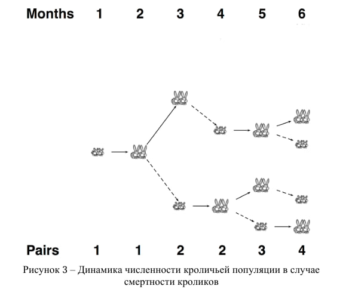

# Отчет по лабораторной работе 1 "Смертные кролики Фибоначчи" (Вариант 2)

## Цель
Модификация классической задачи Фибоначчи с учётом смертности кроликов; разработка программы, моделирующей рост популяции, используя динамическое программирование.

## Задачи
-Учесть срок жизни кроликов (в месяцах) в модели размножения.
-Построить модель, где каждая пара начинает приносить потомство через месяц после рождения и продолжает до своей смерти.
-Реализовать алгоритм динамического программирования для расчёта количества кроликов в заданный месяц.

## Инструментарий для решения задачи
-Язык программирования Python.
-Одномерный список (list) для хранения значений по месяцам.
-Алгоритм динамического программирования для эффективного подсчёта.
-Условные операторы и цикл for.

## Ход работы
1.Реализована функция rabbit_pairs(n, m), где n — количество месяцев, m — срок жизни кроликов в месяцах.
2.Создаётся список dp длиной n + 1 для хранения количества пар кроликов по месяцам.
3.Устанавливаем начальные условия: на первом месяце — 1 пара кроликов.
4.Для каждого месяца, начиная со второго, вычисляется количество пар как сумма:
-числа пар в предыдущем месяце (живые кролики); 
-числа пар, рожденных теми кроликами, которые родились m месяцев назад (и ещё не умерли).
5.На выходе программа возвращает количество пар кроликов на n-ый месяц.
6.Проведён тест: n = 6, m = 3. Вывод: Количество пар кроликов через 6 месяцев: 4

## Выводы
-В отличие от классической модели Фибоначчи, здесь учитывается ограниченная продолжительность жизни кроликов.
-Использование динамического программирования позволяет эффективно решать задачу даже при больших значениях n.
-Модель отражает более реалистичную ситуацию и показывает, как смертность влияет на популяцию.
-При n = 6 и m = 3 популяция достигает 4 пар кроликов.